# Lyndon Button

Lyndon Buttons are a special component that has CSS created to work outside of the Shadow DOM. This means you can use CSS classes for buttons outside of the component. 
Classes are comprised of three distinct elements:

* `button`: should be applied to all button or links appearing as buttons.
* `button--SIZE`: Adds the internal padding rules to a button. Supports sm|md|lg
* `button--VARIANT`: Adds the color and hover state rules. See below for options. 

The `primary-blue` and `secondary-blue` variants are deprecated. Variants `primary` and `secondary` should be used instead.

<!-- Auto Generated Below -->

## Overview

The primary button component.

## Properties

| Property      | Attribute      | Description                                                | Type                                                                                                                                                                                                                                                                                                                                                                  | Default                      |
| ------------- | -------------- | ---------------------------------------------------------- | --------------------------------------------------------------------------------------------------------------------------------------------------------------------------------------------------------------------------------------------------------------------------------------------------------------------------------------------------------------------- | ---------------------------- |
| `activeState` | `active-state` | Defines active state of button                             | `boolean`                                                                                                                                                                                                                                                                                                                                                             | `undefined`                  |
| `case`        | `case`         | The button case ( optional ) by default is Uppercase       | `"capitalize" \| "lowercase" \| "none" \| "uppercase"`                                                                                                                                                                                                                                                                                                                | `'uppercase'`                |
| `fullwidth`   | `fullwidth`    | Width of button                                            | `boolean`                                                                                                                                                                                                                                                                                                                                                             | `undefined`                  |
| `href`        | `href`         | If no url, then falls back to <button> element (optional). | `string`                                                                                                                                                                                                                                                                                                                                                              | `undefined`                  |
| `icon`        | `icon`         | An icon to display to the right of text (optional).        | `IconName`                                                                                                                                                                                                                                                                                                                                                            | `undefined`                  |
| `iconleft`    | `iconleft`     | An icon to display to the left of text (optional).         | `IconName`                                                                                                                                                                                                                                                                                                                                                            | `undefined`                  |
| `iconsize`    | `iconsize`     | An icon to display to the right of text (optional).        | `Size.FULL \| Size.LG \| Size.MD \| Size.SM \| Size.XL \| Size.XS \| Size.XXL`                                                                                                                                                                                                                                                                                        | `Size.FULL`                  |
| `isBreakout`  | `is-breakout`  | Determines if the button is a breakout button.             | `boolean`                                                                                                                                                                                                                                                                                                                                                             | `false`                      |
| `mode`        | `mode`         | Display mode when nested inside another component.         | `string`                                                                                                                                                                                                                                                                                                                                                              | `undefined`                  |
| `modifier`    | `modifier`     | Modifier class                                             | `string`                                                                                                                                                                                                                                                                                                                                                              | `undefined`                  |
| `navItems`    | `nav-items`    | Dropdown nav items.                                        | `{ title: string; url: string; }[]`                                                                                                                                                                                                                                                                                                                                   | `[]`                         |
| `size`        | `size`         | The internal padding size. sm\|md\|lg\|xl\|xxl             | `Size.FULL \| Size.LG \| Size.MD \| Size.SM \| Size.XL \| Size.XS \| Size.XXL`                                                                                                                                                                                                                                                                                        | `Size.MD`                    |
| `target`      | `target`       | Defines target for links (optional).                       | `string`                                                                                                                                                                                                                                                                                                                                                              | `undefined`                  |
| `titleCase`   | `title-case`   | Defines title case of button                               | `boolean`                                                                                                                                                                                                                                                                                                                                                             | `undefined`                  |
| `variant`     | `variant`      | The button styling to display.                             | `"disabled" \| "dropdown" \| "mobile-nav-link" \| "nav-link" \| "primary" \| "primary-blue" \| "primary-blue-dark" \| "primary-blue-mid" \| "primary-dark" \| "primary-utility-link" \| "secondary" \| "secondary-blue" \| "secondary-dark" \| "secondary-no-border" \| "secondary-transparent" \| "secondary-utility-link" \| "tertiary" \| "white" \| "white-dark"` | `ButtonVariants.BTN_PRIMARY` |

## Slots

| Slot            | Description                 |
| --------------- | --------------------------- |
| `"defaultSlot"` | The button text to display. |

## Dependencies

### Used by

 - [lbj-button-card](../lbj-button-card)
 - [lbj-color-block](../lbj-color-block)
 - [lbj-color-box](../lbj-color-box)
 - [lbj-event](../lbj-event)
 - [lbj-highlight-image](../lbj-highlight-image)
 - [lbj-homepage-hero](../lbj-homepage-hero)
 - [lbj-homepage-teaser-card](../lbj-homepage-teaser-card)
 - [lbj-impact-carousel](../lbj-impact-carousel)
 - [lbj-media-wrapper](../lbj-media-wrapper)
 - [lbj-microsite-footer](../lbj-microsite-footer)
 - [lbj-microsite-hero](../lbj-microsite-hero)
 - [lbj-microsite-home-hero](../lbj-microsite-home-hero)
 - [lbj-microsite-main-menu](../lbj-microsite-main-menu)
 - [lbj-microsite-mobile-menu](../lbj-microsite-mobile-menu)
 - [lbj-mini-catalog](../lbj-mini-catalog)
 - [lbj-popover](../lbj-popover)
 - [lbj-simple-search](../lbj-simple-search)
 - [lbj-sticky-header](../lbj-sticky-header)
 - [lbj-term-detail-hero](../lbj-term-detail-hero)
 - [lbj-utility-menu](../lbj-utility-menu)

### Depends on

- [lbj-icon](../lbj-icon)

### Graph

```mermaid
graph TD;
  lbj-button --> lbj-icon
  lbj-button-card --> lbj-button
  lbj-color-block --> lbj-button
  lbj-color-box --> lbj-button
  lbj-event --> lbj-button
  lbj-highlight-image --> lbj-button
  lbj-homepage-hero --> lbj-button
  lbj-homepage-teaser-card --> lbj-button
  lbj-impact-carousel --> lbj-button
  lbj-media-wrapper --> lbj-button
  lbj-microsite-footer --> lbj-button
  lbj-microsite-hero --> lbj-button
  lbj-microsite-home-hero --> lbj-button
  lbj-microsite-main-menu --> lbj-button
  lbj-microsite-mobile-menu --> lbj-button
  lbj-mini-catalog --> lbj-button
  lbj-popover --> lbj-button
  lbj-simple-search --> lbj-button
  lbj-sticky-header --> lbj-button
  lbj-term-detail-hero --> lbj-button
  lbj-utility-menu --> lbj-button
  style lbj-button fill:#f9f,stroke:#333,stroke-width:4px
```

----------------------------------------------

*Built with [StencilJS](https://stenciljs.com/)*
