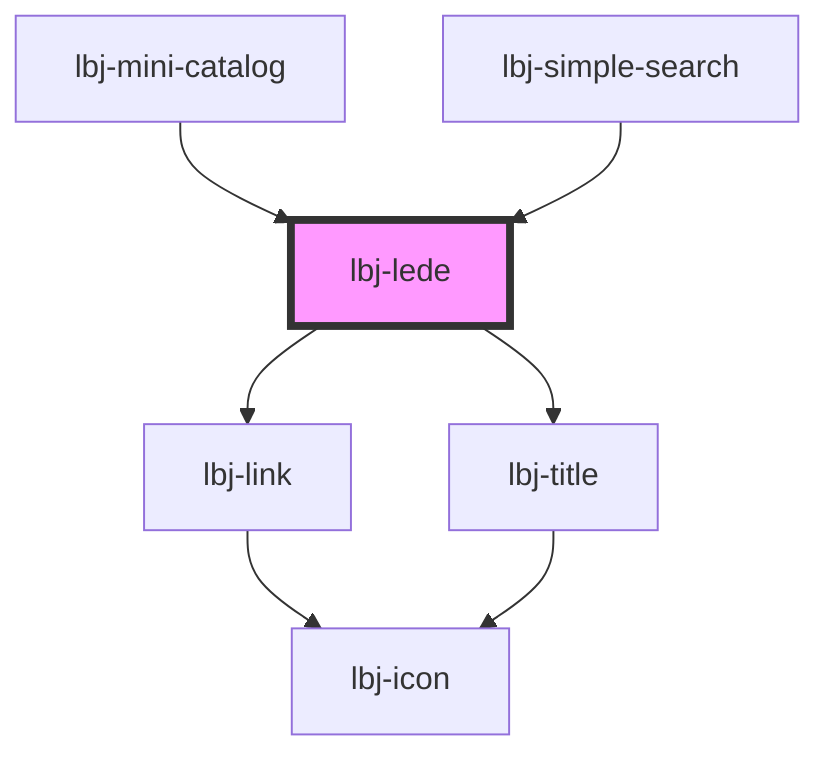

# lbj-lede

<!-- Auto Generated Below -->

## Overview

A introductory lede component.

## Properties

| Property           | Attribute          | Description                                              | Type                                         | Default     |
| ------------------ | ------------------ | -------------------------------------------------------- | -------------------------------------------- | ----------- |
| `accent`           | `accent`           | The text contents of the accent title.                   | `string`                                     | `undefined` |
| `author`           | `author`           | The Array contents of the Author.                        | `{ name: string; url: string; }[]`           | `[]`        |
| `blank_target`     | `blank_target`     |                                                          | `boolean`                                    | `false`     |
| `componentvariant` | `componentvariant` | The different variants of the Lede.                      | `string`                                     | `'lede'`    |
| `date`             | `date`             | The text contents of the date.                           | `string`                                     | `undefined` |
| `eyebrow`          | `eyebrow`          | The text contents of the eyebrow title and url.          | `string \| { name: string; url: string; }[]` | `undefined` |
| `filetype`         | `filetype`         | The file type indicator.                                 | `string`                                     | `undefined` |
| `hasAuthor`        | `has-author`       | Evaluate if Author slot has content.                     | `boolean`                                    | `undefined` |
| `hasSummary`       | `has-summary`      | Evaluate if summary slot has content.                    | `boolean`                                    | `undefined` |
| `hasTopic`         | `has-topic`        | Evaluate if Topic slot has content.                      | `boolean`                                    | `undefined` |
| `headline`         | `headline`         | The text contents of the headline title.                 | `string`                                     | `undefined` |
| `headline_html`    | `headline_html`    |                                                          | `boolean`                                    | `false`     |
| `href`             | `href`             | A wrapping URL for the headline title.                   | `string`                                     | `undefined` |
| `icon`             | `icon`             |                                                          | `string`                                     | `undefined` |
| `summary`          | `summary`          | The text contents of the summary.                        | `string`                                     | `undefined` |
| `tags`             | `tags`             | The tags to display below the headline.                  | `{ name: string; url: string; }[]`           | `[]`        |
| `topic`            | `topic`            | The array contents of the primary topic/ second eyebrow. | `{ name: string; url: string; }[]`           | `[]`        |

## Slots

| Slot         | Description                                         |
| ------------ | --------------------------------------------------- |
| `"accent"`   | Implement lbj-title as heading-2 style with accent. |
| `"date"`     | Implement lbj-title as date style.                  |
| `"eyebrow"`  | Implement lbj-title as eyebrow style.               |
| `"filetype"` | File type indicator.                                |
| `"headline"` | Implement lbj-title as heading-6 style.             |
| `"summary"`  | Summary text below tags.                            |
| `"tags"`     | Tags to be displayed below the headline.            |

## Dependencies

### Used by

 - [lbj-mini-catalog](../lbj-mini-catalog)
 - [lbj-simple-search](../lbj-simple-search)

### Depends on

- [lbj-link](../lbj-link)
- [lbj-title](../lbj-title)

### Graph

----------------------------------------------

*Built with [StencilJS](https://stenciljs.com/)*
