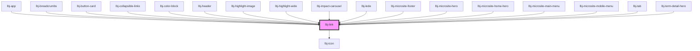

# lbj-link

<!-- Auto Generated Below -->

## Overview

The primary link component.

## Properties

| Property      | Attribute      | Description                                                                                                                                                                              | Type                                                                                                                                                                                                                                                                                                                                                                                                                                                                                                                                                                                                                                                                                                                                                         | Default      |
| ------------- | -------------- | ---------------------------------------------------------------------------------------------------------------------------------------------------------------------------------------- | ------------------------------------------------------------------------------------------------------------------------------------------------------------------------------------------------------------------------------------------------------------------------------------------------------------------------------------------------------------------------------------------------------------------------------------------------------------------------------------------------------------------------------------------------------------------------------------------------------------------------------------------------------------------------------------------------------------------------------------------------------------ | ------------ |
| `dropdown`    | `dropdown`     | Dropdown position.                                                                                                                                                                       | `"floating" \| "static"`                                                                                                                                                                                                                                                                                                                                                                                                                                                                                                                                                                                                                                                                                                                                     | `'floating'` |
| `hasChildren` | `has-children` | Whether the link has children.                                                                                                                                                           | `boolean`                                                                                                                                                                                                                                                                                                                                                                                                                                                                                                                                                                                                                                                                                                                                                    | `undefined`  |
| `href`        | `href`         | The URL that the hyperlink points to.                                                                                                                                                    | `string`                                                                                                                                                                                                                                                                                                                                                                                                                                                                                                                                                                                                                                                                                                                                                     | `undefined`  |
| `icon`        | `icon`         | Toggle trailing icon visibility. - false (default): no icon - true or empty attribute (e.g., `<lbj-link icon>`): show default icon based on theme                                        | `boolean`                                                                                                                                                                                                                                                                                                                                                                                                                                                                                                                                                                                                                                                                                                                                                    | `false`      |
| `iconName`    | `icon-name`    | Optional override for the trailing icon when `icon` is true. Provide a value from `IconName` (e.g., `arrow-right`). Note: Does not by itself make the icon visible; `icon` must be true. | `IconName`                                                                                                                                                                                                                                                                                                                                                                                                                                                                                                                                                                                                                                                                                                                                                   | `undefined`  |
| `mode`        | `mode`         | Display mode when nested inside another component.                                                                                                                                       | `string`                                                                                                                                                                                                                                                                                                                                                                                                                                                                                                                                                                                                                                                                                                                                                     | `undefined`  |
| `state`       | `state`        | Link state active\|inactive\|undefined.                                                                                                                                                  | `"active" \| "active-menu" \| "inactive"`                                                                                                                                                                                                                                                                                                                                                                                                                                                                                                                                                                                                                                                                                                                    | `undefined`  |
| `variant`     | `variant`      | The link style to display.                                                                                                                                                               | `"eyebrow" \| "eyebrow-with-background" \| "small" \| "heading-1" \| "heading-2" \| "heading-3" \| "heading-4" \| "heading-5" \| "heading-6" \| "link" \| "content" \| "nav-primary-light" \| "nav-primary-dark" \| "nav-primary-bumblebee" \| "nav-secondary-dark" \| "nav-secondary-bumblebee" \| "nav-secondary-dual-color" \| "nav-footer" \| "nav-footer--alt" \| "nav-footer--modern" \| "nav-footer--modern-small" \| "nav-footer--alt-normal" \| "nav-footer--small" \| "nav-utility-primary" \| "nav-utility-primary-small" \| "nav-utility-secondary" \| "sub-nav" \| "sub-nav-secondary" \| "pagination" \| "tag" \| "tag-large" \| "task" \| "hero" \| "side-heading-link" \| "app-header-link" \| "small-primary" \| "double-arrow" \| "arrow"` | `'link'`     |

## Slots

| Slot            | Description                   |
| --------------- | ----------------------------- |
| `"defaultSlot"` | A default slot for link text. |

## Dependencies

### Used by

 - [lbj-app](../lbj-app)
 - [lbj-breadcrumbs](../lbj-breadcrumbs)
 - [lbj-button-card](../lbj-button-card)
 - [lbj-collapsible-links](../lbj-collapsible-links)
 - [lbj-color-block](../lbj-color-block)
 - [lbj-header](../lbj-header)
 - [lbj-highlight-image](../lbj-highlight-image)
 - [lbj-highlight-wide](../lbj-highlight-wide)
 - [lbj-impact-carousel](../lbj-impact-carousel)
 - [lbj-lede](../lbj-lede)
 - [lbj-microsite-footer](../lbj-microsite-footer)
 - [lbj-microsite-hero](../lbj-microsite-hero)
 - [lbj-microsite-home-hero](../lbj-microsite-home-hero)
 - [lbj-microsite-main-menu](../lbj-microsite-main-menu)
 - [lbj-microsite-mobile-menu](../lbj-microsite-mobile-menu)
 - [lbj-tab](../lbj-tab)
 - [lbj-term-detail-hero](../lbj-term-detail-hero)

### Depends on

- [lbj-icon](../lbj-icon)

### Graph

----------------------------------------------

*Built with [StencilJS](https://stenciljs.com/)*
