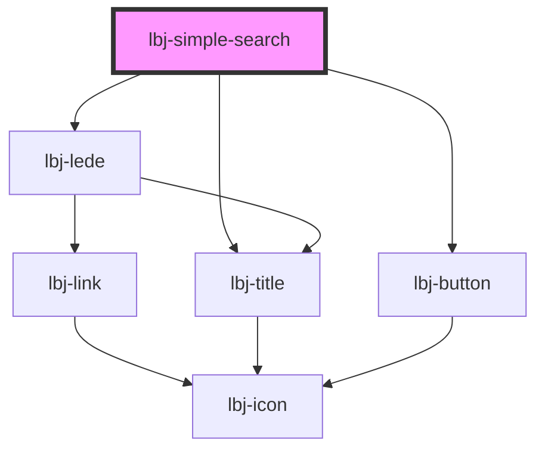

# lbj-footer

<!-- Auto Generated Below -->

## Overview

The simple search block.

## Properties

| Property       | Attribute      | Description                                    | Type     | Default     |
| -------------- | -------------- | ---------------------------------------------- | -------- | ----------- |
| `columns`      | `columns`      | A string to force a two or three column.       | `string` | `undefined` |
| `facetcol`     | `facetcol`     | Facet column to filter.                        | `string` | `undefined` |
| `facetval`     | `facetval`     | Facet value to filter.                         | `string` | `undefined` |
| `filtercol`    | `filtercol`    | The column name to filter.                     | `string` | `undefined` |
| `filtercolval` | `filtercolval` | The value to filter.                           | `string` | `undefined` |
| `fulltext`     | `fulltext`     | Text to search.                                | `string` | `undefined` |
| `headline`     | `headline`     | The headline for the search results.           | `string` | `undefined` |
| `max`          | `max`          | The number of results to return.               | `string` | `undefined` |
| `offset`       | `offset`       | The number of results to skip.                 | `number` | `undefined` |
| `solrindex`    | `solrindex`    | The URI to the solr index powered by JSON:API. | `string` | `undefined` |
| `sort`         | `sort`         | A string to tack on the end for sorting.       | `string` | `undefined` |

## Methods

### `loadResults() => Promise<void>`

Load the results from the solr endpoint.

#### Returns

Type: `Promise<void>`

## Dependencies

### Depends on

- [lbj-lede](../lbj-lede)
- [lbj-button](../lbj-button)
- [lbj-title](../lbj-title)

### Graph

----------------------------------------------

*Built with [StencilJS](https://stenciljs.com/)*
