# lbj-title

<!-- Auto Generated Below -->

## Overview

The page title.

## Properties

| Property          | Attribute         | Description                                                 | Type                                                                                                                                                                                                                                                                                                                                               | Default       |
| ----------------- | ----------------- | ----------------------------------------------------------- | -------------------------------------------------------------------------------------------------------------------------------------------------------------------------------------------------------------------------------------------------------------------------------------------------------------------------------------------------- | ------------- |
| `accent`          | `accent`          | Optionally, add an accent line to highlight content.        | `boolean`                                                                                                                                                                                                                                                                                                                                          | `false`       |
| `element`         | `element`         | The HTML element to use.                                    | `string`                                                                                                                                                                                                                                                                                                                                           | `'div'`       |
| `hasHtml`         | `has-html`        |                                                             | `boolean`                                                                                                                                                                                                                                                                                                                                          | `false`       |
| `icon`            | `icon`            | Optionally, preface the title with an SVG icon.             | `IconName`                                                                                                                                                                                                                                                                                                                                         | `undefined`   |
| `mode`            | `mode`            | Display mode when nested inside another component.          | `string`                                                                                                                                                                                                                                                                                                                                           | `undefined`   |
| `stripe_color`    | `stripe_color`    | Optionally, add a stripe on the bottom.                     | `"stripe-dark-blue" \| "stripe-dark-primary-a" \| "stripe-gray" \| "stripe-green" \| "stripe-light-blue" \| "stripe-light-primary-a" \| "stripe-neutral" \| "stripe-secondary-b" \| "stripe-tertiary-a" \| "stripe-yellow"`                                                                                                                        | `undefined`   |
| `variant`         | `variant`         | The text style to use.                                      | `"caption" \| "date" \| "display" \| "eyebrow" \| "eyebrow-with-background" \| "subtitle" \| "paragraph" \| "small" \| "hero-text" \| "heading-1" \| "heading-2" \| "heading-3" \| "heading-4" \| "heading-5" \| "heading-6" \| "side-heading" \| "card-heading" \| "highlight-eyebrow" \| "banner" \| "universal" \| "medium" \| "heading-block"` | `'paragraph'` |
| `vertical_stripe` | `vertical_stripe` | Optionally, add a vertical stripe to the left of the title. | `VerticalStripeColor.STRIPE_DARK \| VerticalStripeColor.STRIPE_DARK_PRIMARY_A \| VerticalStripeColor.STRIPE_LIGHT_PRIMARY_A \| VerticalStripeColor.STRIPE_NEUTRAL \| VerticalStripeColor.STRIPE_SECONDARY_B \| VerticalStripeColor.STRIPE_SECONDARY_B_ALT \| VerticalStripeColor.STRIPE_TERTIARY_A`                                                | `undefined`   |

## Slots

| Slot            | Description                     |
| --------------- | ------------------------------- |
| `"defaultSlot"` | The text contents of the title. |

## Shadow Parts

| Part       | Description |
| ---------- | ----------- |
| `"accent"` |             |

## Dependencies

### Used by

 - [lbj-breadcrumbs](../lbj-breadcrumbs)
 - [lbj-button-card](../lbj-button-card)
 - [lbj-card](../lbj-card)
 - [lbj-event](../lbj-event)
 - [lbj-file](../lbj-file)
 - [lbj-heading-block](../lbj-heading-block)
 - [lbj-highlight-image](../lbj-highlight-image)
 - [lbj-highlight-wide](../lbj-highlight-wide)
 - [lbj-img](../lbj-img)
 - [lbj-lede](../lbj-lede)
 - [lbj-media-wrapper](../lbj-media-wrapper)
 - [lbj-microsite-footer](../lbj-microsite-footer)
 - [lbj-microsite-hero](../lbj-microsite-hero)
 - [lbj-microsite-home-hero](../lbj-microsite-home-hero)
 - [lbj-microsite-main-menu](../lbj-microsite-main-menu)
 - [lbj-mini-catalog](../lbj-mini-catalog)
 - [lbj-quote-grid](../lbj-quote-grid)
 - [lbj-simple-search](../lbj-simple-search)
 - [lbj-trending-taxonomy](../lbj-trending-taxonomy)

### Depends on

- [lbj-icon](../lbj-icon)

### Graph

```mermaid
graph TD;
  lbj-title --> lbj-icon
  lbj-breadcrumbs --> lbj-title
  lbj-button-card --> lbj-title
  lbj-card --> lbj-title
  lbj-event --> lbj-title
  lbj-file --> lbj-title
  lbj-heading-block --> lbj-title
  lbj-highlight-image --> lbj-title
  lbj-highlight-wide --> lbj-title
  lbj-img --> lbj-title
  lbj-lede --> lbj-title
  lbj-media-wrapper --> lbj-title
  lbj-microsite-footer --> lbj-title
  lbj-microsite-hero --> lbj-title
  lbj-microsite-home-hero --> lbj-title
  lbj-microsite-main-menu --> lbj-title
  lbj-mini-catalog --> lbj-title
  lbj-quote-grid --> lbj-title
  lbj-simple-search --> lbj-title
  lbj-trending-taxonomy --> lbj-title
  style lbj-title fill:#f9f,stroke:#333,stroke-width:4px
```

----------------------------------------------

*Built with [StencilJS](https://stenciljs.com/)*
