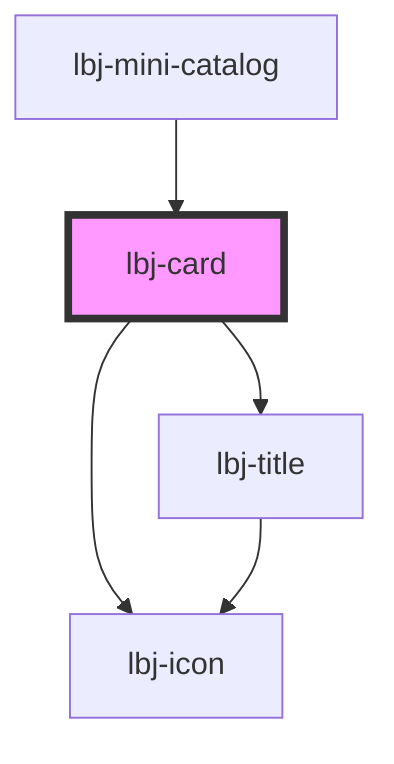

# lbj-card

<!-- Auto Generated Below -->

## Overview

The page title.

## Properties

| Property          | Attribute          | Description                                        | Type                                                                                                                                                                                                                                                                                                                                               | Default     |
| ----------------- | ------------------ | -------------------------------------------------- | -------------------------------------------------------------------------------------------------------------------------------------------------------------------------------------------------------------------------------------------------------------------------------------------------------------------------------------------------- | ----------- |
| `blank_target`    | `blank_target`     |                                                    | `boolean`                                                                                                                                                                                                                                                                                                                                          | `false`     |
| `date`            | `date`             | The text of the date title to display.             | `string`                                                                                                                                                                                                                                                                                                                                           | `undefined` |
| `dateposition`    | `dateposition`     | Date position.                                     | `"above" \| "below"`                                                                                                                                                                                                                                                                                                                               | `'below'`   |
| `eyebrow`         | `eyebrow`          | The text of the eyebrow title to display.          | `string`                                                                                                                                                                                                                                                                                                                                           | `undefined` |
| `headline`        | `headline`         | The text of the headline title to display.         | `string`                                                                                                                                                                                                                                                                                                                                           | `undefined` |
| `headlineVariant` | `headline-variant` | The text of the date title to display.             | `"caption" \| "date" \| "display" \| "eyebrow" \| "eyebrow-with-background" \| "subtitle" \| "paragraph" \| "small" \| "hero-text" \| "heading-1" \| "heading-2" \| "heading-3" \| "heading-4" \| "heading-5" \| "heading-6" \| "side-heading" \| "card-heading" \| "highlight-eyebrow" \| "banner" \| "universal" \| "medium" \| "heading-block"` | `undefined` |
| `headline_html`   | `headline_html`    |                                                    | `boolean`                                                                                                                                                                                                                                                                                                                                          | `false`     |
| `href`            | `href`             | Optionally wrap the headline title with a URL.     | `string`                                                                                                                                                                                                                                                                                                                                           | `undefined` |
| `icon`            | `icon`             | Optionally, preface the headline with an SVG icon. | `IconName`                                                                                                                                                                                                                                                                                                                                         | `undefined` |
| `variant`         | `variant`          | Whether the card is a full size or grid display.   | `"full" \| "grid" \| "hero-basic" \| "hero-featured" \| "research"`                                                                                                                                                                                                                                                                                | `'grid'`    |

## Slots

| Slot      | Description                   |
| --------- | ----------------------------- |
| `"body"`  | The WYSIWYG body content.     |
| `"image"` | Slotted content for an image. |

## Shadow Parts

| Part              | Description |
| ----------------- | ----------- |
| `"research-card"` |             |

## Dependencies

### Used by

 - [lbj-mini-catalog](../lbj-mini-catalog)

### Depends on

- [lbj-icon](../lbj-icon)
- [lbj-title](../lbj-title)

### Graph

----------------------------------------------

*Built with [StencilJS](https://stenciljs.com/)*
