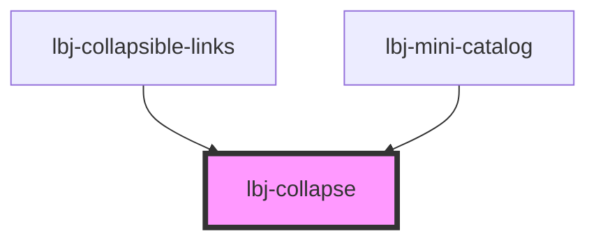

# lbj-collapse

<!-- Auto Generated Below -->

## Overview

The primary collapse component.

## Properties

| Property      | Attribute      | Description                                                                                            | Type                                                                                                                                                                                                                               | Default                                                                                                            |
| ------------- | -------------- | ------------------------------------------------------------------------------------------------------ | ---------------------------------------------------------------------------------------------------------------------------------------------------------------------------------------------------------------------------------- | ------------------------------------------------------------------------------------------------------------------ |
| `detailsId`   | `details-id`   | Optionally provide the details element's id for aria-controls.                                         | `string`                                                                                                                                                                                                                           | `` `collapse-item-${Math.random().toString(36).substring(2, 15) + Math.random().toString(36).substring(2, 15)}` `` |
| `hasHeadline` | `has-headline` | Evaluate if headline slot has content.                                                                 | `boolean`                                                                                                                                                                                                                          | `undefined`                                                                                                        |
| `hasSummary`  | `has-summary`  | Evaluate if summary slot has content.                                                                  | `boolean`                                                                                                                                                                                                                          | `undefined`                                                                                                        |
| `isOpen`      | `is-open`      | Evaluate if it's the first content.                                                                    | `boolean`                                                                                                                                                                                                                          | `undefined`                                                                                                        |
| `level`       | `level`        | Sets the depth of the element for handling nested elements.  Works with variants ['collapsible-link']. | `number`                                                                                                                                                                                                                           | `undefined`                                                                                                        |
| `modifier`    | `modifier`     | Additional classes to apply to the collapse.                                                           | `string`                                                                                                                                                                                                                           | `undefined`                                                                                                        |
| `triggerId`   | `trigger-id`   | Optionally provide a custom id for the event trigger.                                                  | `string`                                                                                                                                                                                                                           | `undefined`                                                                                                        |
| `variant`     | `variant`      | The collapse styling to display.                                                                       | `"background" \| "background-alt" \| "bumblebee" \| "button" \| "chevron" \| "collapsible-link" \| "default" \| "light-blue" \| "light-gray" \| "light-yellow" \| "link" \| "plus" \| "plus-circle" \| "plus-gray" \| "plus-line"` | `'default'`                                                                                                        |

## Events

| Event          | Description | Type                                           |
| -------------- | ----------- | ---------------------------------------------- |
| `stateChanged` |             | `CustomEvent<{ state: boolean; id: string; }>` |

## Slots

| Slot         | Description                                                |
| ------------ | ---------------------------------------------------------- |
| `"content"`  | The content area to show or hide.                          |
| `"headline"` | Optional title area of the collapse.                       |
| `"summary"`  | Optional HTML summary to trigger the show/hide of content. |

## Dependencies

### Used by

 - [lbj-collapsible-links](../lbj-collapsible-links)
 - [lbj-mini-catalog](../lbj-mini-catalog)

### Graph

----------------------------------------------

*Built with [StencilJS](https://stenciljs.com/)*
