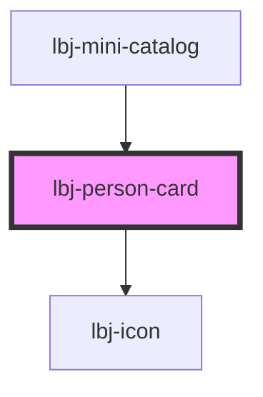

# lbj-person-card

<!-- Auto Generated Below -->

## Properties

| Property        | Attribute       | Description                                  | Type      | Default     |
| --------------- | --------------- | -------------------------------------------- | --------- | ----------- |
| `blank_target`  | `blank_target`  |                                              | `boolean` | `false`     |
| `bluesky`       | `bluesky`       | The Link to person's Bluesky link.           | `string`  | `undefined` |
| `company`       | `company`       | The text contents of the Company name.       | `string`  | `undefined` |
| `hasPosition`   | `has-position`  | Evaluate if Position slot has content.       | `boolean` | `undefined` |
| `headline_html` | `headline_html` |                                              | `boolean` | `false`     |
| `linkedin`      | `linkedin`      | The link to person's linkedin link.          | `string`  | `undefined` |
| `name`          | `name`          | The text contents of the Name of the Author. | `string`  | `undefined` |
| `position`      | `position`      | The text contents of the Job title.          | `string`  | `undefined` |
| `threads`       | `threads`       | The Link to person's Threads link.           | `string`  | `undefined` |
| `twitter`       | `twitter`       | The Link to person's Twitter link.           | `string`  | `undefined` |
| `url`           | `url`           | The Link to Author's profile page.           | `string`  | `undefined` |

## Dependencies

### Used by

 - [lbj-mini-catalog](../lbj-mini-catalog)

### Depends on

- [lbj-icon](../lbj-icon)

### Graph

----------------------------------------------

*Built with [StencilJS](https://stenciljs.com/)*
