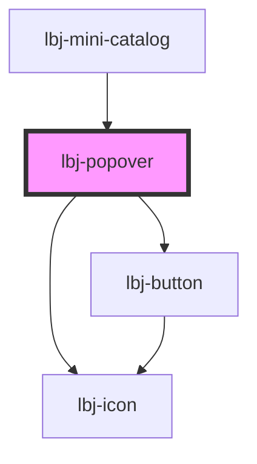

# lbj-popover

<!-- Auto Generated Below -->

## Properties

| Property                 | Attribute                | Description                                                                                                                                                                                  | Type                                                                                                                                                                                                                                                                                                                                                                  | Default                      |
| ------------------------ | ------------------------ | -------------------------------------------------------------------------------------------------------------------------------------------------------------------------------------------- | --------------------------------------------------------------------------------------------------------------------------------------------------------------------------------------------------------------------------------------------------------------------------------------------------------------------------------------------------------------------- | ---------------------------- |
| `btn_icon`               | `btn_icon`               |                                                                                                                                                                                              | `IconName`                                                                                                                                                                                                                                                                                                                                                            | `undefined`                  |
| `btn_iconleft`           | `btn_iconleft`           |                                                                                                                                                                                              | `IconName`                                                                                                                                                                                                                                                                                                                                                            | `undefined`                  |
| `btn_iconsize`           | `btn_iconsize`           |                                                                                                                                                                                              | `Size.FULL \| Size.LG \| Size.MD \| Size.SM \| Size.XL \| Size.XS \| Size.XXL`                                                                                                                                                                                                                                                                                        | `undefined`                  |
| `btn_size`               | `btn_size`               |                                                                                                                                                                                              | `Size.FULL \| Size.LG \| Size.MD \| Size.SM \| Size.XL \| Size.XS \| Size.XXL`                                                                                                                                                                                                                                                                                        | `undefined`                  |
| `btn_variant`            | `btn_variant`            |                                                                                                                                                                                              | `"disabled" \| "dropdown" \| "mobile-nav-link" \| "nav-link" \| "primary" \| "primary-blue" \| "primary-blue-dark" \| "primary-blue-mid" \| "primary-dark" \| "primary-utility-link" \| "secondary" \| "secondary-blue" \| "secondary-dark" \| "secondary-no-border" \| "secondary-transparent" \| "secondary-utility-link" \| "tertiary" \| "white" \| "white-dark"` | `ButtonVariants.BTN_PRIMARY` |
| `popover_action_text`    | `popover_action_text`    |                                                                                                                                                                                              | `string`                                                                                                                                                                                                                                                                                                                                                              | `'Trigger'`                  |
| `popover_close_iconsize` | `popover_close_iconsize` |                                                                                                                                                                                              | `Size.FULL \| Size.LG \| Size.MD \| Size.SM \| Size.XL \| Size.XS \| Size.XXL`                                                                                                                                                                                                                                                                                        | `Size.MD`                    |
| `renderMode`             | `render-mode`            | Controls where the popover dialog is rendered. 'local'  – inside Shadow DOM (default, existing behaviour). 'global' – portalled into document.body so the backdrop covers the full viewport. | `"global" \| "local"`                                                                                                                                                                                                                                                                                                                                                 | `'local'`                    |
| `variant`                | `variant`                |                                                                                                                                                                                              | `string`                                                                                                                                                                                                                                                                                                                                                              | `'button'`                   |

## Dependencies

### Used by

 - [lbj-mini-catalog](../lbj-mini-catalog)

### Depends on

- [lbj-icon](../lbj-icon)
- [lbj-button](../lbj-button)

### Graph

----------------------------------------------

*Built with [StencilJS](https://stenciljs.com/)*
